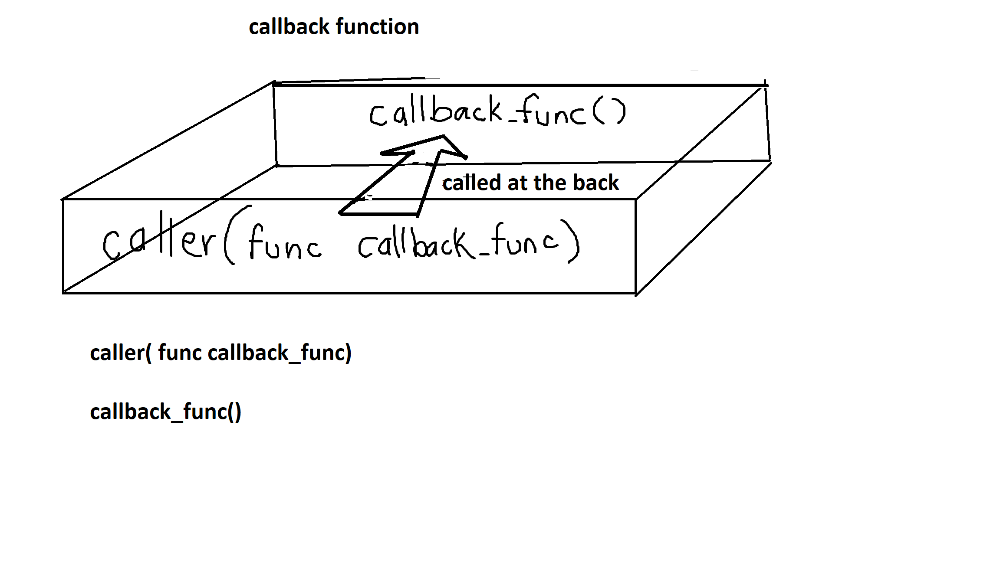

# Callback explanation

What are callback?

- MDN(Mozilla Developer Network) describes a callback as  "a function passed into another function as an argument, which is then invoked inside the outer function to complete some kind of routine or action". 
- Wikipedia: a callback or callback function is any reference to executable code that is passed as an argument to another piece of code; that code is expected to call back (execute) the callback function as part of its job.

visualization:



[Helpful Stack Overflow explanation](https://stackoverflow.com/questions/824234/what-is-a-callback-function#)

What problems do callback solve?
Callbacks are required for event-driven programs.
Callbacks allow programs to be responsive.
Callbacks help your application scale.

Understanding synchronous and asyncrhonous operations will help you understand callbacks. Callbacks are actually independent of async and asynchrony understanding their relationship will help remember why they're needed.

Synchronous operation. 
- Each operation must wait on the previous to finish. 
- FIFO (First in first out). 
- Blocking. 

```
START
func_1() -> 
func_2() -> 
func_3()
END
```

Asynchronous operation. 
- Operations can be partially run and returned to at any time. 
- There are no guarantees that operations will be completed in the order they were called.
- also called non-blocking operations

```
START
database request -> handle_db() -> 
keyboard input ->  handle_kb() -> 
mouse input -> handle_mouse() -> 
finish handle_mouse() -> 
finish handle_kb() ->
finish handle_db()
END
```

In GUIs and windowing systems immediate callbacks are used which means the callback function is called immediately after the calling function.

In networking deferred callback / asynchronous callbacks are needed.

Deferred callbacks happen when code can't run to completion immediately because they need to wait for other data to come in. A callback function might not be called immediately.

Imagine a world with no callbacks and no async. This is what it would look like.

# Fully Synchronous

GUI

Imagine clicking a button to do a calculation on a website, your browser freezes for 10 seconds before getting an answer.

```
button_click(run_calculation())
```

Network

Imagine a server that needs to serve 100,000 clients at the same time. Assume that it takes 2 seconds to serve 1 request. The server only works synchronously. Clients get chosen at random and have to wait their turn. The first client would only have to wait 2 seconds, but the 100,000th would have to wait 200,000 seconds or 55.55 hours or 2.31 days for their request to handle. A client would have to wait 100,000 seconds on average or ~1 day for their request to resolve. Sounds fucked up right? It is. Would you be willing to wait 1 day on average for your Reddit or Facebook post to update.

# Callbacks to the rescue

GUI
You click a button but the website still works and you get your calculation 10 seconds later.

Network
You and 99,999 other clients are using a social media website and your posts update within a few seconds.


A server taking a request from a client can't immediately resolve the request because it needs to take requests from 100,000 other clients. If the server did operations synchronously clients might have to wait a long time. Imagine having to wait 1 minute to see your Facebook post update. You would get pissed off. We usually see it update within the second right? The server simply cannot block and wait for the synchronous functions to finish. It must handle client requests quickly. There has to be a better way, and there is.


callback is a function that will be called when a process is done executing a specific task.


The OG function calls a function and lets it run concurrently on it's own. It tells the called function to callback/interrupt when it's done.
f1 -> f3
   \f2 

Your program must allow functions to callback when they are done running to let the original caller know it is done.

How are callbacks used?
"Callbacks are used to program applications in windowing systems. In this case, the application supplies (a reference to) a specific custom callback function for the operating system to call, which then calls this application-specific function in response to events like mouse clicks or key presses."

Implementations

How are they implemented in actual technologies.
javascript = first order functions, you can save functions as objects and pass them to other functions
C# - delegates, are a pointer to a function that can be saved to a variable


How do callbacks relate to dependency injection?
DI is the process of providing the callback(the dependency) to the object.
The callback is the dependency of the object that is being passed into.


Callback example:

```js
// https://stackoverflow.com/questions/824234/what-is-a-callback-function
// A function which accepts another function as an argument
// (and will automatically invoke that function when it completes - note that there is no explicit call to callbackFunction)
funct printANumber(int number, funct callbackFunction) {
    printout("The number you provided is: " + number);
}

// a function which we will use in a driver function as a callback function
funct printFinishMessage() {
    printout("I have finished printing numbers.");
}

// Driver method
funct event() {
   printANumber(6, printFinishMessage);
}
```
[MDN](https://developer.mozilla.org/en-US/docs/Glossary/Callback_function)

[wikipedia](https://en.wikipedia.org/wiki/Callback_(computer_programming))

Which is it?
Oxford Languages definition of back
- back - toward the rear
   - make a call to the back (the callback function input)
- back - expressing a return to an earlier or normal condition.
   - go back to the calling function's context

